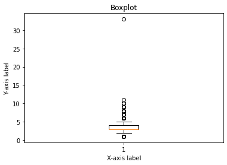
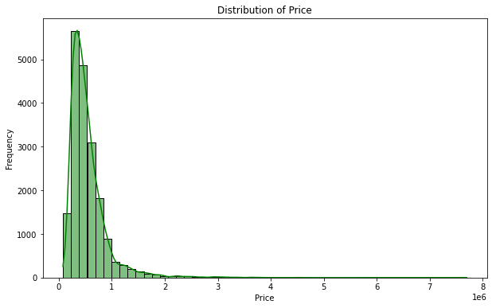
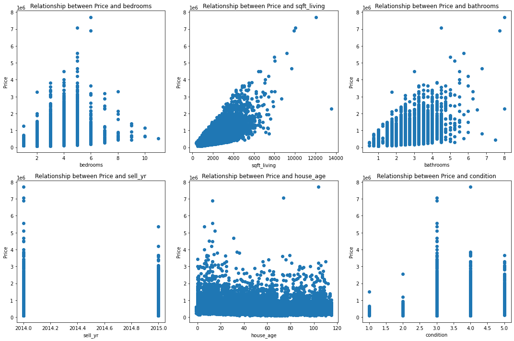
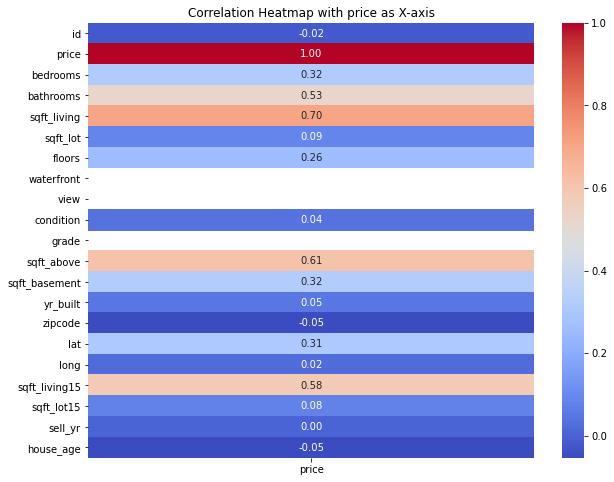
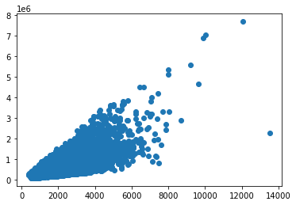
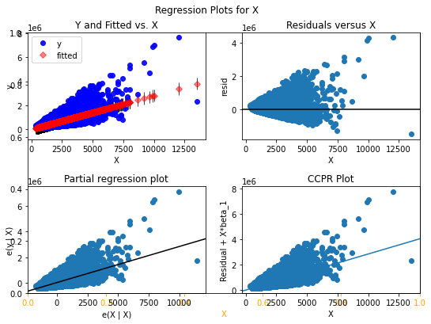
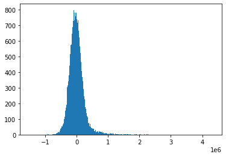
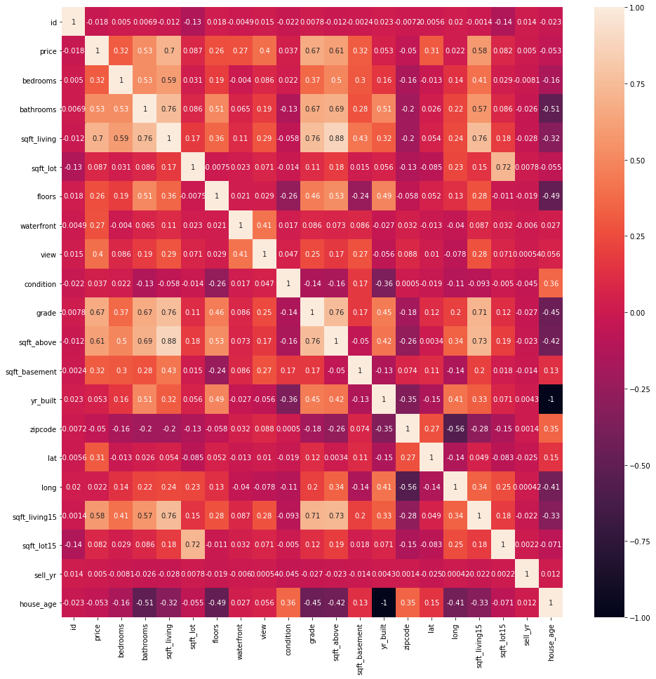
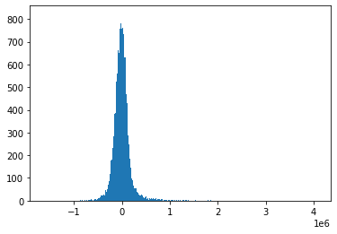
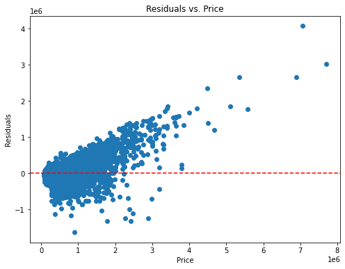

# Final Project Submission

Please fill out:
* Student name: Hellen Samuel,Calvine Dasilver,Sandra kiptum ,Jack Otieno,Salahudin 
* Student pace: full time
* Scheduled project review date/time: 
* Instructor name: NIKITA

 # Demystifying House Sales Analysis with Regression Modeling in a Northwestern County

 

## Project Overview
Business Understanding
The real estate market is a vital component of regional economic health and stability. This project delves into the dynamics of house sales in a specific northwestern county in the United States, aiming to unravel the key factors influencing property valuation in this area.

## Challenges of a Fluctuating Real Estate Market:
1. Market fluctuations make it difficult for real estate agents to price houses and guide clients on offers.
2. Rapid price fluctuations create a challenging environment for homebuyers, making it difficult to secure a good deal and avoid overpaying.
3. Trying to pick the perfect moment to sell a house for maximum profit feels like playing the lottery – stressful, unpredictable, and with slim odds of success.
4. High land prices and buyers struggling to afford homes make it difficult for builders to build new houses.

## Problem Statements
We want to find out what makes houses expensive in a certain county in the northwest US. We'll also look at ways to measure how much these things like number of bedrooms or location affect the price. Finally, we'll see if we can build a tool to predict house prices based on these important features.

## Conclusion
Our study looked at how the ups and downs of the housing market in a northwestern county are making things tough for everyone involved. To help out, we're building a tool to predict house prices. This will give real estate agents valuable information so they can give their clients the best advice in this unpredictable market.

## Proposed Solutions
Utilizing multiple linear regression, a powerful machine learning technique, to analyze a large dataset of house sales and identify statistical relationships between property features and sale prices.

## Objectives
1. Develop a robust multiple linear regression model that accurately predicts house prices in the chosen northwestern county.
2. Identify the most significant factors influencing property value within this specific market.
3. Provide valuable insights into the housing market dynamics of the region, benefiting potential buyers, real estate agents, and other stakeholders.

## Data Understanding

**Dataset Description**

The analysis utilizes the King County House Sales dataset, comprising over 21,500 records and 20 distinct features. Spanning house sales from May 2014 to May 2015, the dataset offers a comprehensive snapshot of the housing market.

**Key Columns**

<li> id: Unique identifier for a house
<li> date: Date of house sale
<li> price: Sale price (prediction target)
<li> bedrooms, bathrooms, sqft_living, sqft_lot, floors, view, condition, grade, sqft_above, sqft_basement, yr_built, yr_renovated, zipcode, sqft_living15, sqft_lot15, sell_yr

**Data preparation**
we import the necessary functions and clean the data in the following ways

1. checking the data and null values
2. deleting the columns with null values
3. checking for non-numeric columns
4. checking for duplicates
5. creating the necessary columns
6. checking for outliers using the box plot and deleting the outliers

**Exploratory Data Analysis**

we will perform exploratory data analysis (EDA) to understand the data better and discover any patterns, trends using univariate,bivariate and multivariate analysis

We will use descriptive statistics and visualizations to summarize the main characteristics of the data and examine the relationships between the features and the target variable.

We will also check the distribution and correlation of the variables and identify any potential problems or opportunities for the analysis.

 # Univariate Analysis

Univariate analysis involves the examination of single variables.We focus in the summary statistics of target variable-price to help us undersatand the distribution and skewness of house prices.

 # Visualizing the distribution of 'price' using a histogram

 

 The histogram shows that the distribution of house price is positively skewed suggesting that while most houses are concentrated around lower prices, there are some properties with significantly higher prices.

  # Bivariate Analysis

We perform bivariate analysis to examine the relationship between the target variable - price and the other numeric and continuous features in the data using the scatter plots to show the direction, strength, and shape of the relationship between two numeric variables.

The scatter plots show that there is a positive relationship between most of the independent variables and the price of a house. This means that houses with higher values for these variables tend to be more expensive

 # Multivariate Analysis

 In this section, we will perform multivariate analysis to examine the relationship between the target variable - price and multiple features in the data. We will use heatmap to visualize the correlation matrix of the features and see how they are related to each other and to the price.

 

The heatmap shows that Positive correlations are typically represented by shades of red, and negative correlations by shades of blue. We note that bathrooms and sqft_living are highly positively correlated.

**Regression Modelling**
 # Simple Linear Regression

For simple linear regression we will use the one column that has the strongest correlation to the price, this will also be or baseline model for the multiple linear regression.

1. Checking for correlation

from the correlation sqft_living has the highest correlatio with price, we will therefore use sqft_living as the exogenous variable and price as our endogenous variable.
plot using a scatter plot

from this we can see that there is a linearity between the two variables satisfying one of the 4 LINE specifications.

2. building the model

we build the model qand interprate our models results

we are plotting our residuals to understand where our model is perfoming best and where it is performing poorly

our graphs give us the same information as our summary did
from this we can see that our residuals are not normally distributed we can solve this but using multiple linear distribution

 # Multiple Linear Regression

For Multiple Linear Regression, we are going to use more than one predictor variable to predict price for our case

Our baseline for this model will be the linear Regression that we just did above
We then clean our data 

The image above is a heatmap of the cleaned data
 
 # Building the model

1. we build the model,fit it and interprate the results

2. we check for normality

From the diagram above we can see that the errors are not normaly distributed and therefore we will check the other assumptions to evaluate

3. plotting the model

4. independence of errors
We are going to find out the predicted y of the model and calculate the residual from there on

This shows where our modle works best

5. evaluating the model
From this we can see that due to Outliers,Nonlinear Relationships,Heteroscedasticity and overfitting our MSE and RMSE are high, we will build another model to remidy this factors.

**Constraints and Considerations**

<li> Data may contain anomalies or inconsistencies necessitating careful examination.
<li> Time frame (May 2014 - May 2015) may not fully reflect current market dynamics.
<li> Scope of data may not capture external factors such as interest rates or economic climate influencing property values.
 
## RECOMMENDATIONS
From the 3 modules built we advise potential buyers or sellers to concider model 3 in determining the price of a house. We can also suggest that the factor affecting the price of a house most is square foot living but they should concider increasing the number of bathrooms during renovations for the case of the sellers.

## NEXT STEPS
1.Find more features that home buyers often value highly to add to the model
2.Correlate the information of this model with ones for other states

